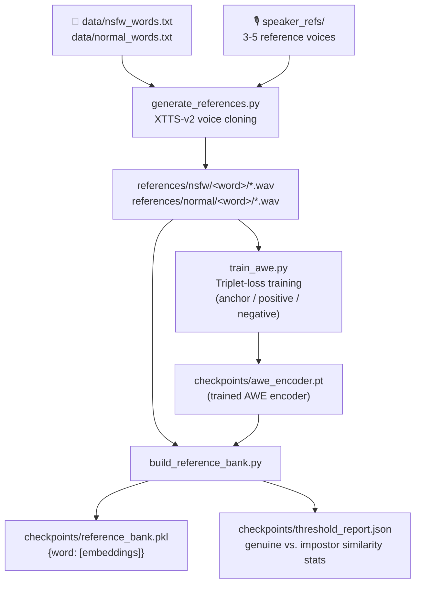
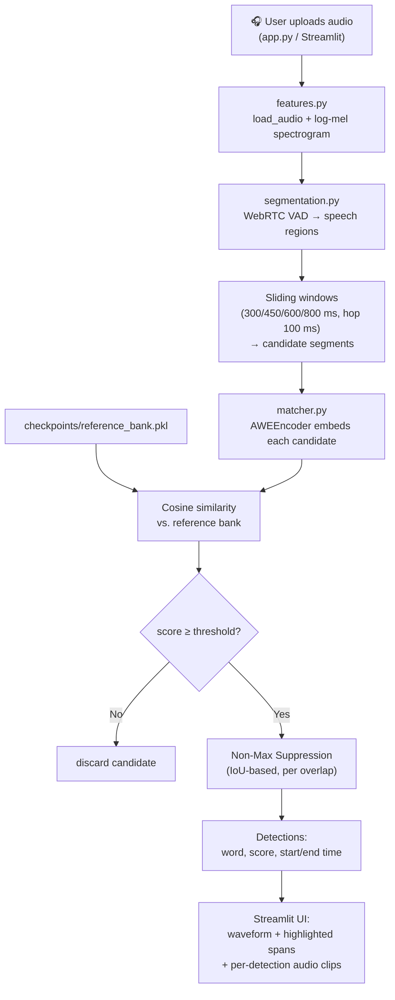
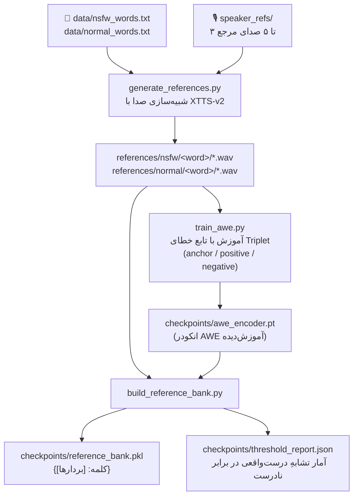
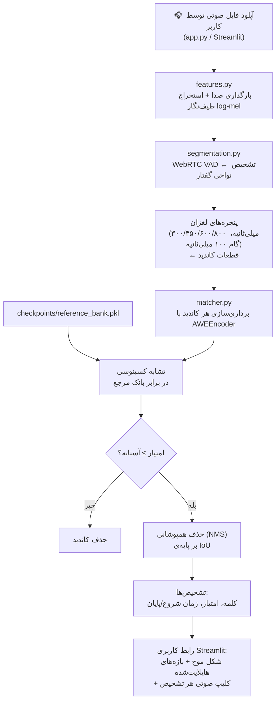

# 🔊 NSFW Audio Keyword Spotter

> Detecting NSFW keywords in audio via **Acoustic Word Embeddings (AWE)** — no ASR / full speech-to-text involved.

[]()
[]()
[]()
[]()

---

## Table of Contents

- [About the Project](#about-the-project)
- [What is Keyword Spotting?](#what-is-keyword-spotting)
- [Pipeline Overview](#pipeline-overview)
  - [Offline Pipeline (Setup / Training)](#offline-pipeline-setup--training)
  - [Online Pipeline (Inference / Demo)](#online-pipeline-inference--demo)
- [How the Demo Works](#how-the-demo-works)
- [Features](#features)
- [Project Structure](#project-structure)
- [Requirements](#requirements)
- [Installation & Usage](#installation--usage)
- [Configuration](#configuration)
---

## About the Project

This project scans an uploaded audio clip and flags occurrences of a predefined list of NSFW (inappropriate) words, **without ever running full speech recognition (ASR)**. Instead, it relies on **Acoustic Word Embeddings (AWE)**: short audio segments are mapped into a vector space where segments containing the *same spoken word* land close together, regardless of speaker or minor acoustic variation. Flagging a word then becomes a nearest-neighbor / similarity-search problem against a bank of reference embeddings, rather than a transcription problem.

The pipeline is split into two stages:

1. **Offline stage** — synthesize reference audio for each target word (using voice-cloning TTS), train the AWE encoder with triplet loss, and build a reference embedding bank.
2. **Online stage** — the Streamlit app segments an uploaded recording into word-length candidate windows, embeds them, compares them against the reference bank, and reports matches above a similarity threshold.

## What is Keyword Spotting?

**Keyword Spotting (KWS)** is the task of detecting whether — and where — specific spoken words occur in an audio stream, without transcribing the entire utterance. It's the same family of technology behind wake-words like *"Hey Siri"* or *"OK Google"*. Compared to full ASR, KWS is:

- **Lighter weight** — no need for a language model or full vocabulary decoder.
- **More targeted** — it only needs to answer "does word *W* occur here?", not "what was said?".
- **Well suited to open-vocabulary or template matching** approaches like AWE similarity search, where new target words can be added just by supplying reference audio, without retraining a full ASR system.

In this project, KWS is implemented as an **embedding + similarity search** problem: candidate audio snippets are embedded and compared by cosine similarity to a bank of known NSFW-word embeddings.

## Pipeline Overview

### Offline Pipeline (Setup / Training)



**Steps:**
1. Fill `data/nsfw_words.txt` (target words) and `data/normal_words.txt` (negative/control words).
2. `generate_references.py` synthesizes each word in each of 3–5 cloned voices using **XTTS‑v2**.
3. `train_awe.py` trains the `AWEEncoder` (2D‑CNN + masked temporal pooling) with **triplet margin loss** so same‑word embeddings pull together and different‑word embeddings push apart.
4. `build_reference_bank.py` encodes every NSFW reference clip with the trained encoder into a reference bank, and calibrates a suggested similarity threshold from genuine vs. impostor similarity statistics.

### Online Pipeline (Inference / Demo)



**Steps:**
1. The user uploads a `.wav/.mp3/.m4a/.flac/.ogg` file in the Streamlit app.
2. `segmentation.py` runs **WebRTC VAD** to isolate speech regions, then slides multiple candidate window sizes (recall‑oriented, brute‑force) across each region.
3. `matcher.py` embeds every candidate with the trained AWE encoder and computes cosine similarity against the full reference bank in one matrix multiplication.
4. Candidates scoring above the (user‑adjustable) similarity threshold are kept, then **Non‑Max Suppression** collapses overlapping candidates so each real occurrence is reported once.
5. Results are rendered as highlighted regions on the waveform, plus a table with word, confidence score, timestamp, and a playable audio clip per detection.

## How the Demo Works

The demo is a single-page **Streamlit** app (`app.py`):

1. On startup, it loads the trained AWE model and the reference bank (cached with `@st.cache_resource` so it only loads once).
2. The sidebar lets you adjust the **similarity threshold** live and shows the list of loaded NSFW reference words.
3. Upload an audio file → it's saved to a temp file, loaded and resampled to 16 kHz.
4. The detection pipeline (segmentation → embedding → matching → NMS) runs and returns a list of detections.
5. A **Plotly waveform plot** is shown with red-shaded regions marking each detected keyword span.
6. If anything was detected, a **status banner** (🚫 / ✅) summarizes the result, and a detail table lists each occurrence with its word, confidence score, time range, and an inline audio player for that exact clip.

## Features

- 🧠 **No ASR required** — detection is done purely via embedding similarity, not transcription.
- 🗣️ **Speaker‑agnostic** — triplet training across multiple synthetic voices makes the encoder robust to voice/speaker variation.
- 🎯 **Adjustable sensitivity** — live similarity threshold slider, backed by a calibrated suggestion (`threshold_report.json`).
- 🪟 **Multi-scale candidate windows** — several window sizes (300–800 ms) catch words of varying length.
- ✂️ **VAD-based pruning** — skips silence/non-speech to cut down candidate count and false positives.
- 🧹 **Non-Max Suppression** — deduplicates overlapping detections so each word occurrence is reported once.
- 📊 **Interactive waveform visualization** with highlighted detection spans (Plotly).
- 🔊 **Per-detection audio playback** — listen to exactly the flagged clip.
- ➕ **Extensible vocabulary** — add a new target word just by adding it to the wordlist and regenerating references + rebuilding the bank; no full retrain of the whole pipeline logic required (though retraining refines general discrimination).

## Project Structure

```
nsfw_kws_app/
├── app.py                     # Streamlit UI (entry point)
├── config.py                  # Central configuration (paths & hyperparameters)
├── features.py                # Audio loading + log-mel spectrogram extraction
├── segmentation.py            # WebRTC VAD + sliding-window candidate generation
├── awe_model.py                # AWEEncoder (2D-CNN, masked temporal pooling)
├── matcher.py                  # Embedding, similarity matching, NMS
├── generate_references.py      # XTTS-v2 reference audio synthesis
├── train_awe.py                # Triplet-loss training loop
├── build_reference_bank.py     # Builds embedding bank + threshold calibration
├── requirements.txt
├── data/
│   ├── nsfw_words.txt          # target words (you fill this in)
│   └── normal_words.txt        # negative/control words
├── speaker_refs/                # 3-5 reference voice clips for XTTS cloning
├── references/                  # synthesized per-word audio (XTTS output)
│   ├── nsfw/<word>/*.wav
│   └── normal/<word>/*.wav
└── checkpoints/
    ├── awe_encoder.pt           # trained AWE encoder weights
    ├── reference_bank.pkl       # {word: [embeddings]}
    └── threshold_report.json    # genuine vs. impostor similarity stats
```

## Requirements

- **Python** 3.10+
- Core dependencies (see `requirements.txt`):
  - `streamlit`, `torch==2.5.1`, `torchaudio==2.5.1`
  - `librosa`, `soundfile`, `numpy<2.0.0`, `networkx<3.0.0`, `scipy`
  - `webrtcvad`, `audiomentations`, `tqdm`, `plotly`
  - `transformers==4.40.0`, `setuptools<82`
- **Coqui TTS** `>=0.22.0` (for `generate_references.py` — voice cloning with XTTS‑v2). Note: this package is unmaintained, so the pins above intentionally match its known-working environment (see comments in `requirements.txt`).
- A CUDA-capable GPU is recommended for training (`train_awe.py`) and reference generation, but the pipeline falls back to CPU automatically.
- 3–5 short (6–10s) clean speech `.wav` clips placed in `speaker_refs/` to drive the voice cloning.

## Installation & Usage

```bash
# 1. Clone the repository
git clone <your-repo-url>
cd nsfw_kws_app

# 2. Create and activate a virtual environment
python -m venv venv
source venv/bin/activate      # on Windows: venv\Scripts\activate

# 3. Install dependencies
pip install -r requirements.txt
pip install TTS>=0.22.0
pip check   # should report no broken requirements

# 4. Fill in the word lists
#    data/nsfw_words.txt      -> target NSFW words, one per line
#    data/normal_words.txt    -> normal/negative words, one per line

# 5. Add 3-5 reference speaker voice clips (6-10s, clean speech, .wav)
#    into speaker_refs/

# 6. Run the offline pipeline (in order)
python generate_references.py      # synthesize reference audio (XTTS-v2)
python train_awe.py                # train the AWE encoder
python build_reference_bank.py     # build the reference embedding bank

# 7. Launch the demo
streamlit run app.py
```

Then open the local URL Streamlit prints (typically `http://localhost:8501`), upload an audio file, and inspect the detections.

## Screenshots

> _Add screenshots of the running app here once available, e.g.:_

| Upload & Settings | Detection Result |
|---|---|
| `docs/screenshot_sidebar.png` | `docs/screenshot_detection.png` |

```markdown


```

## Configuration

All tunables live in `config.py`, including:

- Audio: `SAMPLE_RATE`, `N_MELS`, `N_FFT`, `HOP_LENGTH`
- XTTS synthesis: `XTTS_MODEL_NAME`, `XTTS_LANGUAGE`, `MIN_SPEAKER_REFS`, `MAX_SPEAKER_REFS`
- AWE training: `EMBED_DIM`, `TRIPLET_MARGIN`, `TRAIN_EPOCHS`, `TRAIN_BATCH_SIZE`, `TRIPLETS_PER_EPOCH`, `LEARNING_RATE`
- Segmentation: `VAD_AGGRESSIVENESS`, `VAD_FRAME_MS`, `WINDOW_SIZES_MS`, `WINDOW_HOP_MS`
- Matching: `DEFAULT_SIM_THRESHOLD`, `NMS_IOU_THRESHOLD`


---
---


# 🔊 سامانه تشخیص کلمات نامناسب در صدا (NSFW Audio Keyword Spotter)

> تشخیص کلمات نامناسب (NSFW) در فایل صوتی با استفاده از **بردارهای صوتی کلمه (Acoustic Word Embeddings - AWE)** — بدون استفاده از تشخیص گفتار کامل (ASR).

---

## فهرست مطالب

- [درباره پروژه](#درباره-پروژه)
- [مفهوم Keyword Spotting چیست؟](#مفهوم-keyword-spotting-چیست)
- [نمای کلی پایپ‌لاین](#نمای-کلی-پایپلاین)
  - [پایپ‌لاین آفلاین (آماده‌سازی / آموزش)](#پایپلاین-آفلاین-آمادهسازی--آموزش)
  - [پایپ‌لاین آنلاین (استنتاج / دمو)](#پایپلاین-آنلاین-استنتاج--دمو)
- [نحوه کار دمو](#نحوه-کار-دمو)
- [ویژگی‌ها](#ویژگیها)
- [ساختار پروژه](#ساختار-پروژه)
- [نیازمندی‌ها](#نیازمندیها)
- [نصب و اجرا](#نصب-و-اجرا)
- [پیکربندی](#پیکربندی)

---

## درباره پروژه

این پروژه یک فایل صوتی آپلودشده را اسکن می‌کند و وقوع کلماتِ از پیش‌تعریف‌شده‌ی نامناسب (NSFW) را در آن شناسایی می‌کند، **بدون این‌که هیچ‌گاه تشخیص گفتار کامل (ASR)** اجرا شود. در عوض، این سامانه بر پایه‌ی **بردارهای صوتی کلمه (AWE)** کار می‌کند: بخش‌های کوتاه صوتی به یک فضای برداری نگاشت می‌شوند به‌گونه‌ای که بخش‌های حاوی *یک کلمه‌ی یکسان* — صرف‌نظر از گوینده یا تغییرات جزئی آکوستیکی — نزدیک به هم قرار می‌گیرند. بنابراین تشخیص یک کلمه به یک مسئله‌ی جست‌وجوی نزدیک‌ترین‌همسایه / تشابه بردار در برابر یک بانک بردارهای مرجع تبدیل می‌شود، نه یک مسئله‌ی رونویسی متن.

پایپ‌لاین به دو مرحله تقسیم می‌شود:

1. **مرحله‌ی آفلاین** — تولید صوت مرجع برای هر کلمه‌ی هدف (با استفاده از TTS شبیه‌سازی صدا)، آموزش انکودر AWE با تابع خطای Triplet، و ساخت بانک بردارهای مرجع.
2. **مرحله‌ی آنلاین** — اپلیکیشن Streamlit، ضبط آپلودشده را به بازه‌های کاندید هم‌اندازه‌ی کلمه تقسیم می‌کند، آن‌ها را برداری (embed) می‌کند، با بانک مرجع مقایسه می‌کند و تطابق‌های بالاتر از آستانه‌ی تشابه را گزارش می‌دهد.

## مفهوم Keyword Spotting چیست؟

**Keyword Spotting (KWS)** یا «تشخیص کلمه‌ی کلیدی»، وظیفه‌ی تشخیص این است که آیا — و در کجا — کلمات گفتاری خاصی در یک جریان صوتی رخ می‌دهند، بدون این‌که کل گفتار رونویسی شود. این همان خانواده‌ی فناوری است که پشت کلمات بیدارباش (wake-word) مانند *"Hey Siri"* یا *"OK Google"* قرار دارد. در مقایسه با ASR کامل، KWS:

- **سبک‌تر** است — نیازی به مدل زبانی یا دیکودر واژگان کامل نیست.
- **هدفمندتر** است — فقط باید به این سؤال پاسخ دهد که «آیا کلمه‌ی *W* اینجا رخ داده؟»، نه «چه گفته شده؟».
- **برای رویکردهای واژگان باز یا تطبیق الگو** مانند جست‌وجوی تشابه AWE بسیار مناسب است، جایی که می‌توان کلمات هدف جدید را صرفاً با ارائه‌ی صوت مرجع اضافه کرد، بدون نیاز به آموزش مجدد کل سامانه‌ی ASR.

در این پروژه، KWS به‌صورت یک مسئله‌ی **بردارسازی + جست‌وجوی تشابه** پیاده‌سازی شده است: قطعات صوتی کاندید برداری می‌شوند و با تشابه کسینوسی با بانکی از بردارهای کلمات NSFW شناخته‌شده مقایسه می‌شوند.

## نمای کلی پایپ‌لاین

### پایپ‌لاین آفلاین (آماده‌سازی / آموزش)



**مراحل:**
1. فایل‌های `data/nsfw_words.txt` (کلمات هدف) و `data/normal_words.txt` (کلمات منفی/کنترل) را پر کنید.
2. اسکریپت `generate_references.py` هر کلمه را با ۳ تا ۵ صدای شبیه‌سازی‌شده با **XTTS-v2** تولید می‌کند.
3. اسکریپت `train_awe.py` مدل `AWEEncoder` (شبکه‌ی CNN دوبعدی + میانگین‌گیری زمانی ماسک‌دار) را با **تابع خطای حاشیه‌ای Triplet** آموزش می‌دهد تا بردارهای یک کلمه‌ی یکسان به هم نزدیک و بردارهای کلمات متفاوت از هم دور شوند.
4. اسکریپت `build_reference_bank.py` تمام کلیپ‌های مرجع NSFW را با انکودر آموزش‌دیده به بردار تبدیل کرده و در بانک مرجع ذخیره می‌کند، و همچنین یک آستانه‌ی تشابه‌ی پیشنهادی را از روی آمار تشابهِ درست‌واقعی در برابر نادرست محاسبه می‌کند.

### پایپ‌لاین آنلاین (استنتاج / دمو)



**مراحل:**
1. کاربر یک فایل با فرمت `.wav/.mp3/.m4a/.flac/.ogg` را در اپلیکیشن Streamlit آپلود می‌کند.
2. `segmentation.py` با استفاده از **WebRTC VAD** نواحی گفتار را جدا می‌کند، سپس چند اندازه‌ی پنجره‌ی کاندید مختلف را (با رویکرد بازگشت‌محور و جامع) روی هر ناحیه می‌لغزاند.
3. `matcher.py` هر کاندید را با انکودر AWE آموزش‌دیده برداری می‌کند و تشابه کسینوسی آن را در برابر کل بانک مرجع، در یک ضرب ماتریسی، محاسبه می‌کند.
4. کاندیدهایی که امتیازشان بالاتر از آستانه‌ی تشابه (قابل‌تنظیم توسط کاربر) باشد نگه داشته می‌شوند، سپس **حذف همپوشانی (NMS)** کاندیدهای هم‌پوشان را ادغام می‌کند تا هر وقوع واقعی فقط یک‌بار گزارش شود.
5. نتایج به‌صورت نواحی هایلایت‌شده روی شکل موج، به‌همراه جدولی شامل کلمه، امتیاز اطمینان، زمان‌بندی، و یک کلیپ صوتی قابل‌پخش برای هر تشخیص نمایش داده می‌شود.

## نحوه کار دمو

دمو یک اپلیکیشن تک‌صفحه‌ای **Streamlit** است (`app.py`):

1. هنگام اجرا، مدل AWE آموزش‌دیده و بانک مرجع بارگذاری می‌شوند (با `@st.cache_resource` کش می‌شوند تا فقط یک‌بار بارگذاری شوند).
2. نوار کناری امکان تنظیم زنده‌ی **آستانه‌ی تشابه** را می‌دهد و فهرست کلمات مرجع NSFW بارگذاری‌شده را نشان می‌دهد.
3. با آپلود یک فایل صوتی → فایل به‌صورت موقت ذخیره شده، بارگذاری و با نرخ نمونه‌برداری ۱۶ کیلوهرتز بازنمونه‌برداری می‌شود.
4. پایپ‌لاین تشخیص (قطعه‌بندی ← برداری‌سازی ← تطبیق ← NMS) اجرا شده و فهرستی از تشخیص‌ها بازمی‌گرداند.
5. یک **نمودار شکل موج با Plotly** نمایش داده می‌شود که در آن نواحی تشخیص هر کلمه با رنگ قرمز هایلایت شده‌اند.
6. در صورت وجود تشخیص، یک **بنر وضعیت** (🚫 / ✅) نتیجه را خلاصه می‌کند، و یک جدول جزئیات، هر وقوع را به‌همراه کلمه، امتیاز اطمینان، بازه‌ی زمانی، و یک پخش‌کننده‌ی صوتی درون‌خطی برای همان کلیپ دقیق فهرست می‌کند.

## ویژگی‌ها

- 🧠 **بدون نیاز به ASR** — تشخیص کاملاً از طریق تشابه بردار انجام می‌شود، نه رونویسی.
- 🗣️ **مستقل از گوینده** — آموزش Triplet روی چند صدای مصنوعی مختلف، انکودر را نسبت به تغییرات صدا/گوینده مقاوم می‌کند.
- 🎯 **حساسیت قابل‌تنظیم** — اسلایدر آستانه‌ی تشابه به‌صورت زنده، همراه با یک مقدار پیشنهادیِ کالیبره‌شده (`threshold_report.json`).
- 🪟 **پنجره‌های کاندید چندمقیاسی** — چند اندازه‌ی پنجره (۳۰۰ تا ۸۰۰ میلی‌ثانیه) کلمات با طول‌های متفاوت را پوشش می‌دهند.
- ✂️ **هرس بر پایه‌ی VAD** — سکوت/نواحی غیرگفتاری را نادیده می‌گیرد تا تعداد کاندیدها و نتایج مثبت کاذب کاهش یابد.
- 🧹 **حذف همپوشانی (NMS)** — تشخیص‌های هم‌پوشان را ادغام می‌کند تا هر وقوع کلمه فقط یک‌بار گزارش شود.
- 📊 **تجسم تعاملی شکل موج** با نواحی تشخیص هایلایت‌شده (Plotly).
- 🔊 **پخش صوتی برای هر تشخیص** — امکان شنیدن دقیق همان کلیپ پرچم‌گذاری‌شده.
- ➕ **واژگان قابل‌گسترش** — افزودن یک کلمه‌ی هدف جدید تنها با اضافه‌کردن آن به لیست کلمات و بازتولید مراجع + بازسازی بانک ممکن است؛ نیازی به آموزش مجدد کامل کل پایپ‌لاین نیست (هرچند آموزش مجدد، تمایز کلی را بهبود می‌دهد).

## ساختار پروژه

```
nsfw_kws_app/
├── app.py                     # رابط کاربری Streamlit (نقطه‌ی ورود)
├── config.py                  # پیکربندی مرکزی (مسیرها و هایپرپارامترها)
├── features.py                # بارگذاری صدا + استخراج طیف‌نگار log-mel
├── segmentation.py            # WebRTC VAD + تولید کاندید با پنجره‌ی لغزان
├── awe_model.py                # AWEEncoder (CNN دوبعدی، میانگین‌گیری زمانی ماسک‌دار)
├── matcher.py                  # برداری‌سازی، تطبیق تشابه، NMS
├── generate_references.py      # تولید صوت مرجع با XTTS-v2
├── train_awe.py                # حلقه‌ی آموزش با تابع خطای Triplet
├── build_reference_bank.py     # ساخت بانک بردارها + کالیبراسیون آستانه
├── requirements.txt
├── data/
│   ├── nsfw_words.txt          # کلمات هدف (باید خودتان پر کنید)
│   └── normal_words.txt        # کلمات منفی/کنترل
├── speaker_refs/                # ۳ تا ۵ کلیپ صدای مرجع برای شبیه‌سازی با XTTS
├── references/                  # صوت تولیدشده برای هر کلمه (خروجی XTTS)
│   ├── nsfw/<word>/*.wav
│   └── normal/<word>/*.wav
└── checkpoints/
    ├── awe_encoder.pt           # وزن‌های انکودر AWE آموزش‌دیده
    ├── reference_bank.pkl       # {کلمه: [بردارها]}
    └── threshold_report.json    # آمار تشابهِ درست‌واقعی در برابر نادرست
```

## نیازمندی‌ها

- **پایتون** نسخه‌ی ۳.۱۰ به بالا
- وابستگی‌های اصلی (به `requirements.txt` مراجعه کنید):
  - `streamlit`، `torch==2.5.1`، `torchaudio==2.5.1`
  - `librosa`، `soundfile`، `numpy<2.0.0`، `networkx<3.0.0`، `scipy`
  - `webrtcvad`، `audiomentations`، `tqdm`، `plotly`
  - `transformers==4.40.0`، `setuptools<82`
- **Coqui TTS** نسخه‌ی `>=0.22.0` (برای `generate_references.py` — شبیه‌سازی صدا با XTTS-v2). توجه: این پکیج دیگر نگهداری نمی‌شود، بنابراین نسخه‌های ثابت‌شده‌ی بالا عمداً با محیط شناخته‌شده‌ی سالم آن هم‌خوانی دارند (به کامنت‌های داخل `requirements.txt` مراجعه کنید).
- برای آموزش (`train_awe.py`) و تولید مراجع، استفاده از یک GPU سازگار با CUDA توصیه می‌شود، اما پایپ‌لاین به‌صورت خودکار روی CPU نیز اجرا می‌شود.
- ۳ تا ۵ کلیپ صوتی کوتاه (۶ تا ۱۰ ثانیه) با گفتار تمیز در فرمت `.wav` داخل پوشه‌ی `speaker_refs/` برای شبیه‌سازی صدا.

## نصب و اجرا

```bash
# ۱. کلون کردن مخزن
git clone <your-repo-url>
cd nsfw_kws_app

# ۲. ساخت و فعال‌سازی محیط مجازی
python -m venv venv
source venv/bin/activate      # در ویندوز: venv\Scripts\activate

# ۳. نصب وابستگی‌ها
pip install -r requirements.txt
pip install TTS>=0.22.0
pip check   # نباید هیچ وابستگی خرابی گزارش شود

# ۴. پر کردن لیست کلمات
#    data/nsfw_words.txt      -> کلمات هدف NSFW، هر کدام در یک خط
#    data/normal_words.txt    -> کلمات عادی/منفی، هر کدام در یک خط

# ۵. افزودن ۳ تا ۵ کلیپ صدای گوینده‌ی مرجع (۶ تا ۱۰ ثانیه، گفتار تمیز، .wav)
#    داخل پوشه‌ی speaker_refs/

# ۶. اجرای پایپ‌لاین آفلاین (به ترتیب)
python generate_references.py      # تولید صوت مرجع (XTTS-v2)
python train_awe.py                # آموزش انکودر AWE
python build_reference_bank.py     # ساخت بانک بردارهای مرجع

# ۷. اجرای دمو
streamlit run app.py
```

سپس آدرس محلی‌ای که Streamlit چاپ می‌کند (معمولاً `http://localhost:8501`) را باز کنید، یک فایل صوتی آپلود کنید، و تشخیص‌ها را بررسی کنید.

## تصاویر (Screenshots)

> _پس از در دسترس بودن، تصاویر واقعی از اجرای برنامه را اینجا اضافه کنید، مثلاً:_

| تنظیمات و آپلود | نتیجه‌ی تشخیص |
|---|---|
| `docs/screenshot_sidebar.png` | `docs/screenshot_detection.png` |

```markdown


```

## پیکربندی

تمام پارامترهای قابل‌تنظیم در فایل `config.py` قرار دارند، از جمله:

- صدا: `SAMPLE_RATE`، `N_MELS`، `N_FFT`، `HOP_LENGTH`
- سنتز XTTS: `XTTS_MODEL_NAME`، `XTTS_LANGUAGE`، `MIN_SPEAKER_REFS`، `MAX_SPEAKER_REFS`
- آموزش AWE: `EMBED_DIM`، `TRIPLET_MARGIN`، `TRAIN_EPOCHS`، `TRAIN_BATCH_SIZE`، `TRIPLETS_PER_EPOCH`، `LEARNING_RATE`
- قطعه‌بندی: `VAD_AGGRESSIVENESS`، `VAD_FRAME_MS`، `WINDOW_SIZES_MS`، `WINDOW_HOP_MS`
- تطبیق: `DEFAULT_SIM_THRESHOLD`، `NMS_IOU_THRESHOLD`


